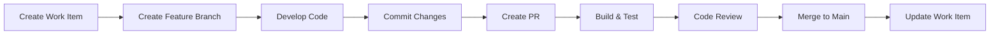

# Azure DevOps MCP Configuration

This document describes how to set up Model Context Protocol (MCP) integration with Azure DevOps for your Business Central development workflow.

## Overview

MCP (Model Context Protocol) allows AI assistants like GitHub Copilot to interact with Azure DevOps, enabling:
- Work item management
- Pull request creation and review
- Build pipeline monitoring
- Test result analysis
- Repository operations

## Prerequisites

1. Azure DevOps organization and project
2. Personal Access Token (PAT) with appropriate permissions
3. VS Code with GitHub Copilot extension
4. MCP client configuration

## Setup Instructions

### 1. Generate Azure DevOps PAT

1. Navigate to Azure DevOps → User Settings → Personal Access Tokens
2. Create new token with the following scopes:
   - **Code**: Read, Write
   - **Work Items**: Read, Write
   - **Build**: Read
   - **Test Management**: Read
   - **Project and Team**: Read

3. Save the token securely

### 2. Configure MCP Client

Create or edit your MCP configuration file (usually `~/.config/mcp/config.json`):

```json
{
  "mcpServers": {
    "azure-devops": {
      "command": "npx",
      "args": ["-y", "@azure/mcp-server-azure-devops"],
      "env": {
        "AZURE_DEVOPS_ORG": "your-organization",
        "AZURE_DEVOPS_PROJECT": "your-project",
        "AZURE_DEVOPS_PAT": "your-personal-access-token"
      }
    }
  }
}
```

### 3. Environment Variables

Alternatively, set environment variables:

```bash
export AZURE_DEVOPS_ORG="your-organization"
export AZURE_DEVOPS_PROJECT="your-project"
export AZURE_DEVOPS_PAT="your-personal-access-token"
```

For Windows PowerShell:
```powershell
$env:AZURE_DEVOPS_ORG = "your-organization"
$env:AZURE_DEVOPS_PROJECT = "your-project"
$env:AZURE_DEVOPS_PAT = "your-personal-access-token"
```

## Usage Examples

### Work Item Management

#### Create Work Item
```
Create a new user story in Azure DevOps:
Title: Implement customer credit check
Description: Add validation to check customer credit limit before order posting
Area Path: BC Development/Sales
Iteration: Sprint 23
```

#### Query Work Items
```
Show me all open bugs assigned to me in Azure DevOps
```

#### Update Work Item
```
Update work item #1234:
- Set state to Active
- Add comment: Starting implementation
- Update remaining work to 8 hours
```

### Pull Request Operations

#### Create Pull Request
```
Create a pull request in Azure DevOps:
- Source branch: feature/credit-check
- Target branch: develop
- Title: Add customer credit limit validation
- Description: Implements validation logic for customer credit checks
- Reviewers: john.doe@company.com
```

#### Review Pull Request
```
Review pull request #456 in Azure DevOps and provide feedback
```

### Build and Release

#### Check Build Status
```
Show me the status of the latest build for the main branch
```

#### Trigger Build
```
Trigger a build for the feature/credit-check branch
```

### Repository Operations

#### Get File Contents
```
Show me the contents of src/SalesManagement.Codeunit.al from Azure DevOps
```

#### Search Code
```
Search for "CalculateCreditLimit" in the Azure DevOps repository
```

## Integration with BC Development Workflow

### 1. Feature Development Workflow



### 2. Automated Work Item Updates

Configure Azure DevOps to automatically:
- Link commits to work items using #WorkItemID in commit messages
- Update work item state when PR is created/merged
- Add build status to work items
- Track deployment status

### 3. CI/CD Pipeline Integration

Example Azure Pipelines YAML for BC:

```yaml
trigger:
  - main
  - develop

pool:
  vmImage: 'windows-latest'

variables:
  bcVersion: '22.0'
  containerName: 'bcserver'

stages:
  - stage: Build
    jobs:
      - job: BuildAL
        steps:
          - task: PowerShell@2
            displayName: 'Setup BC Container'
            inputs:
              targetType: 'inline'
              script: |
                Install-Module BcContainerHelper -Force
                New-BcContainer -accept_eula -containerName $(containerName)
          
          - task: PowerShell@2
            displayName: 'Compile AL Extension'
            inputs:
              targetType: 'inline'
              script: |
                Compile-AppInBcContainer -containerName $(containerName) `
                  -appProjectFolder ./src `
                  -appOutputFolder ./output
          
          - task: PublishBuildArtifacts@1
            inputs:
              PathtoPublish: './output'
              ArtifactName: 'BC-Extension'

  - stage: Test
    dependsOn: Build
    jobs:
      - job: RunTests
        steps:
          - task: PowerShell@2
            displayName: 'Run AL Tests'
            inputs:
              targetType: 'inline'
              script: |
                Run-TestsInBcContainer -containerName $(containerName)

  - stage: Deploy
    dependsOn: Test
    condition: and(succeeded(), eq(variables['Build.SourceBranch'], 'refs/heads/main'))
    jobs:
      - deployment: DeployToProduction
        environment: 'Production'
        strategy:
          runOnce:
            deploy:
              steps:
                - task: PowerShell@2
                  displayName: 'Deploy Extension'
                  inputs:
                    targetType: 'inline'
                    script: |
                      # Deploy to BC environment
```

## Copilot Integration Prompts

### Work Item Creation
```
Using Azure DevOps MCP, create a work item for implementing [feature name]
Include acceptance criteria and link to related work items
```

### Code Review with Work Item Context
```
Review this AL code in the context of work item #1234
Check if it meets the acceptance criteria
```

### Deployment Status
```
Check the deployment status of the current sprint's work items
Show me any failed deployments or blocked items
```

## Best Practices

### 1. Commit Message Format
```
<type>(<scope>): <subject> #<work-item-id>

<body>

<footer>
```

Example:
```
feat(sales): Add credit limit validation #1234

Implement validation logic to check customer credit limit
before allowing order posting. Includes error messages and
user notifications.

Closes #1234
```

### 2. Branch Naming
```
<type>/<work-item-id>-<short-description>
```

Examples:
- `feature/1234-credit-limit-check`
- `bugfix/5678-posting-error`
- `hotfix/9012-security-patch`

### 3. Pull Request Template

Configure Azure DevOps PR template:

```markdown
## Related Work Items
- Fixes #<work-item-id>
- Related to #<work-item-id>

## Changes Made
- List of changes
- Another change

## Testing Performed
- [ ] Unit tests added/updated
- [ ] Manual testing completed
- [ ] Integration tests passed

## Screenshots (if applicable)
Add screenshots here

## Checklist
- [ ] Code follows AL coding standards
- [ ] XML documentation added
- [ ] Tests added/updated
- [ ] Work item updated
```

### 4. Automated Quality Gates

Configure Azure DevOps policies:
- Require PR reviews
- Require successful build
- Require code coverage threshold
- Require work item linking
- Require comment resolution

## Troubleshooting

### Connection Issues
- Verify PAT is valid and not expired
- Check organization and project names
- Ensure PAT has required permissions
- Verify network connectivity

### Authentication Errors
- Regenerate PAT if expired
- Check environment variables are set correctly
- Verify PAT scope includes required permissions

### API Rate Limiting
- Implement retry logic with exponential backoff
- Cache frequently accessed data
- Use batch APIs when available

## Security Considerations

1. **Never commit PAT to source control**
2. Use Azure Key Vault for PAT storage
3. Rotate PATs regularly
4. Use minimum required permissions
5. Enable MFA on Azure DevOps account
6. Monitor PAT usage and audit logs
7. Use service principals for automation

## Additional Resources

- [Azure DevOps REST API](https://docs.microsoft.com/rest/api/azure/devops/)
- [Azure DevOps CLI](https://docs.microsoft.com/azure/devops/cli/)
- [MCP Documentation](https://modelcontextprotocol.io/)
- [BC Container Helper](https://github.com/microsoft/navcontainerhelper)

## Support

For issues or questions:
1. Check Azure DevOps service health
2. Review MCP server logs
3. Verify configuration settings
4. Contact your DevOps administrator
